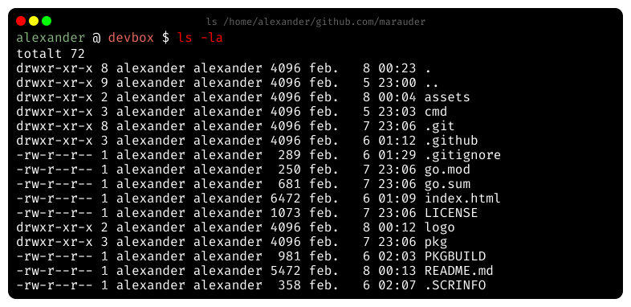

<!-- PROJECT SHIELDS -->
[![Contributors][contributors-shield]][contributors-url]
[![Forks][forks-shield]][forks-url]
[![Stargazers][stars-shield]][stars-url]
[![Issues][issues-shield]][issues-url]
[![MIT License][license-shield]][license-url]
[![LinkedIn][linkedin-shield]][linkedin-url]


<!-- PROJECT LOGO -->
<br />
<p align="center">
  <a href="https://github.com/alexanderbrevig/marauder">
    
  </a>

  <h3 align="center">Marauder</h3>

  <p align="center">
    A tool for documenting CLI operations. 
    <br />
    <quote>I solemnly swear I am up to no good.</quote>
    <br />
    <a href="https://github.com/alexanderbrevig/marauder"><strong>Explore the docs »</strong></a>
    <br />
    <br />
    ·
    <a href="https://github.com/alexanderbrevig/marauder/issues">Report Features & Bug</a>
  </p>
</p>


<!-- TABLE OF CONTENTS -->
<details open="open">
  <summary><h2 style="display: inline-block">Table of Contents</h2></summary>
  <ol>
    <li>
      <a href="#about-the-project">About The Project</a>
      <ul>
        <li><a href="#built-with">Built With</a></li>
      </ul>
    </li>
    <li>
      <a href="#getting-started">Getting Started</a>
      <ul>
        <li><a href="#prerequisites">Prerequisites</a></li>
        <li><a href="#installation">Installation</a></li>
      </ul>
    </li>
    <li><a href="#usage">Usage</a></li>
    <li><a href="#roadmap">Roadmap</a></li>
    <li><a href="#contributing">Contributing</a></li>
    <li><a href="#license">License</a></li>
    <li><a href="#contact">Contact</a></li>
    <li><a href="#acknowledgements">Acknowledgements</a></li>
  </ol>
</details>


<!-- ABOUT THE PROJECT -->
## About The Project

First run the project.
I may suggest aliasing it to `log` `proof` `oscplog` whatever fits your needs.

    marauder ls -la
 
Running this command will create one a text file for future reference.

    alexander@devbox:/home/alexander/github.com/marauder$ ls -la
    totalt 72
    drwxr-xr-x 8 alexander alexander 4096 feb.   8 00:37 .
    drwxr-xr-x 9 alexander alexander 4096 feb.   5 23:00 ..
    drwxr-xr-x 2 alexander alexander 4096 feb.   8 00:38 assets
    drwxr-xr-x 3 alexander alexander 4096 feb.   5 23:03 cmd
    drwxr-xr-x 8 alexander alexander 4096 feb.   7 23:06 .git
    drwxr-xr-x 3 alexander alexander 4096 feb.   6 01:12 .github
    -rw-r--r-- 1 alexander alexander  289 feb.   6 01:29 .gitignore
    -rw-r--r-- 1 alexander alexander  250 feb.   7 23:06 go.mod
    -rw-r--r-- 1 alexander alexander  681 feb.   7 23:06 go.sum
    -rw-r--r-- 1 alexander alexander 6377 feb.   8 00:37 index.html
    -rw-r--r-- 1 alexander alexander 1073 feb.   7 23:06 LICENSE
    drwxr-xr-x 2 alexander alexander 4096 feb.   8 00:12 logo
    drwxr-xr-x 3 alexander alexander 4096 feb.   7 23:06 pkg
    -rw-r--r-- 1 alexander alexander  981 feb.   6 02:03 PKGBUILD
    -rw-r--r-- 1 alexander alexander 5407 feb.   8 00:37 README.md
    -rw-r--r-- 1 alexander alexander  358 feb.   6 02:07 .SCRINFO

You will also get a fake screenshot of a terminal, handy for writing reports.

<p align="center"></p>

### Built With

* [Go](https://golang.org/)


<!-- GETTING STARTED -->
## Getting Started

To get a local copy up and running follow these simple steps.

### Prerequisites

* golang

### Installation

1. Clone the repo
   ```sh
   git clone https://github.com/alexanderbrevig/marauder.git
   ```
2. Run the program
   ```go
   go run cmd/marauder/main.go ls -la
   ```
3. Install if you want
   ```sh
   GOBIN=/usr/local/bin/ go install cmd/marauder/marauder.go
   ```

<!-- USAGE EXAMPLES -->
## Usage

   ```sh
   marauder ls -la
   ```

You will now have a file called `$DATE ls -la.txt` with the output of ls, and a `$DATE ls -la.png` with a simulated screenshot of the terminal.

### Configuration

Place a `.marauder.yml` in your home directory. 
Optionally choose any location and set `MARAUDER_CONFIG` to point to that directory.

    # /home/alexander/.marauder.yml 
    #userName: alexander
    #hostName: devbox
    outDir: /home/alexander/github.com/marauder/test
    datePrefix: false
    lineLimit: 100
    fontSIze: 16
    terminalMargin: 10
    textMargin: 10
    colors:
        button1: "ff0000"
        button2: "ffff00"
        button3: "00ff00"
        background: "060606"
        title: "666666"
        userName: "89b482"
        at: "ffffff"
        hostName: "ea6962"
        dollar: "ffffff"
        command: "ff0000"
        terminal: "ffffff"

It is also worth knowing that every config has a corresponding environment variable.

They map such that the `userName` stanza becomes `MARAUDER_USER_NAME`. 
You can also override colors with `MARAUDER_COLOR_*`.

If you want to signal something as green, do

    MARAUDER_COLOR_COMMAND="00ff00" marauder ls -la

<!-- ROADMAP -->
## Roadmap

See the [open issues](https://github.com/alexanderbrevig/marauder/issues) for a list of proposed features (and known issues).


<!-- CONTRIBUTING -->
## Contributing

Contributions are what make the open source community such an amazing place to be learn, inspire, and create. Any contribuions you make are **greatly appreciated**.

1. Fork the Project
2. Create your Feature Branch (`git checkout -b feature/AmazingFeature`)
3. Commit your Changes (`git commit -m 'Add some AmazingFeature'`)
4. Push to the Branch (`git push origin feature/AmazingFeature`)
5. Open a Pull Request


<!-- LICENSE -->
## License

Distributed under the MIT License. See `LICENSE` for more information.


<!-- CONTACT -->
## Contact

Your Name - [@alexanderbrevig](https://twitter.com/alexanderbrevig) - alexanderbrevig@gmail.com

Project Link: [https://github.com/alexanderbrevig/marauder](https://github.com/alexanderbrevig/marauder)


<!-- ACKNOWLEDGEMENTS -->
## Acknowledgements

* [Amazing Go Graphics Library](github.com/fogleman/gg)


<!-- MARKDOWN LINKS & IMAGES -->
<!-- https://www.markdownguide.org/basic-syntax/#reference-style-links -->
[contributors-shield]: https://img.shields.io/github/contributors/alexanderbrevig/marauder.svg?style=for-the-badge
[contributors-url]: https://github.com/alexanderbrevig/marauder/graphs/contributors
[forks-shield]: https://img.shields.io/github/forks/alexanderbrevig/marauder.svg?style=for-the-badge
[forks-url]: https://github.com/alexanderbrevig/marauder/network/members
[stars-shield]: https://img.shields.io/github/stars/alexanderbrevig/marauder.svg?style=for-the-badge
[stars-url]: https://github.com/alexanderbrevig/marauder/stargazers
[issues-shield]: https://img.shields.io/github/issues/alexanderbrevig/marauder.svg?style=for-the-badge
[issues-url]: https://github.com/alexanderbrevig/marauder/issues
[license-shield]: https://img.shields.io/github/license/alexanderbrevig/marauder.svg?style=for-the-badge
[license-url]: https://github.com/alexanderbrevig/marauder/blob/master/LICENSE.txt
[linkedin-shield]: https://img.shields.io/badge/-LinkedIn-black.svg?style=for-the-badge&logo=linkedin&colorB=555
[linkedin-url]: https://linkedin.com/in/alexanderbrevig
